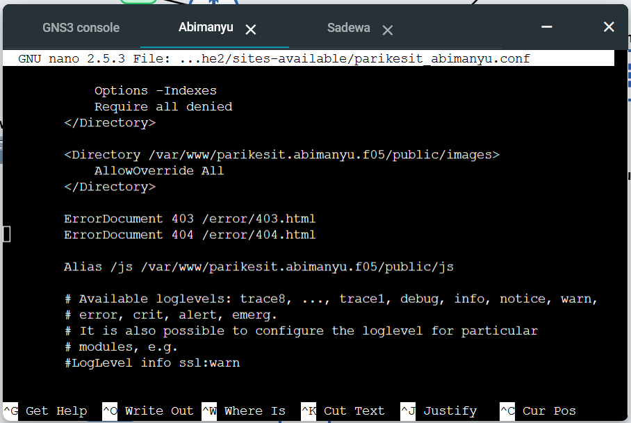

### 11.

Melakukan konfigurasi Apache Web Server pada worker Abimanyu dengan web server www.abimanyu.f05.com dengan document root /var/www/abimanyu.f05.  
 Pertama instalol apache2 pada node

```
apt-get install apache2 -y
```

kemudian edit file yang berada di

```
/etc/apache2/sites-available/000-default.conf
```

dan ditambahkan konfigurasi berikut

```
DocumentRoot /var/www/abimanyu.f05
ServerName abimanyu.f05.com
ServerAlias www.abimanyu.f05.com
```


### 12.

Melakukan perubahan agar url www.abimanyu.f05.com/index.php/home menjadi www.abimanyu.f05.com. Kita dapat menambahkan alias pada file

```
/etc/apache2/sites-available/000-default.conf
```

lalu tambahkan

```
 Alias "/home" "/var/www/abimanyu.f05/index.php/home"
```

Restart apache2 kemudian akses www.abimanyu.f05.com/home

```
service apache2 restart
```


### 13.

Pada subdomain www.parikesit.abimanyu.f05.com document root disimpan pada `/var/www/parikesit.abimanyu.f05` kemudian lakukan konfigurasi pada file

```
/etc/apache2/sites-available/parikesit_abimanyu.conf
```

lalu tambahkan

```
DocumentRoot /var/www/parikesit.abimanyu.f05
ServerName parikesit.abimanyu.f05.com
ServerAlias www.parikesit.abimanyu.f05.com
```

Kemudian kita buat folder tersebut dan diisi dengan file yang telah disediakan dengan command berikut

```
cd /var/www

wget --no-check-certificate 'https://docs.google.com/uc?export=download&id=1LdbYntiYVF_NVNgJis1GLCLPEGyIOreS' -O FILENAME

unzip FILENAME

mkdir /var/www/parikesit.abimanyu.f05

cd /var/www/parikesit.abimanyu.yyy.com

mv /var/www/parikesit.abimanyu.yyy.com/error /var/www/parikesit.abimanyu.f05/error
mv /var/www/parikesit.abimanyu.yyy.com/public /var/www/parikesit.abimanyu.f05/public

cd /var/www/

rm FILENAME
rm -r parikesit.abimanyu.yyy.com
```

Setelah melakukan konfigurasi lakukan a2ensite lalu restart apache

```
a2ensite parikesit_abimanyu.conf
service apache2 restart
```

### 14.

Pada subdomain /public hanya dapat melakukan directory listring sedangkan pada folder /secret tidak dapat diakses(403 forbidden). Lakukan konfigurasi di

```
/etc/apache2/sites-available/parikesit_abimanyu.conf
```

kemudian tambahkan

```
<Directory /var/www/parikesit.abimanyu.f05/public>
    Options +Indexes
</Directory>

<Directory /var/www/parikesit.abimanyu.f05/secret>
    Options -Indexes
    Require all denied
</Directory>
```

  
kemudian buat folder secret dengan file html di dalamnya

```
mkdir /var/www/parikesit.abimanyu.f05/secret

echo "<!DOCTYPE html>
<html lang="en">
<head>
  <meta charset="UTF-8">
  <meta name="viewport" content="width=device-width, initial-scale=1.0">
  <title>Document</title>
</head>
<body>
    <p>test</p>
</body>
</html> " > test.html

cp test.html /var/www/parikesit.abimanyu.f05/secret/index.html
```

`service apache2 restart`  
lalu dicoba lynx ke dua subdomain tersebut.
/public
  
/secret  


### 15.

Untuk kustomisasi halaman error agar diganti dengan file yang bedara di /error dapat mengubah file

```
/etc/apache2/sites-available/parikesit_abimanyu.conf
```

lalu menambahkan

```
ErrorDocument 403 /error/403.html
ErrorDocument 404 /error/404.html
```

restart apache2. Nantinya jika menemukan error 403 atau 404 akan diarahkan ke halaman tersebut.

### 16.

membuat konfigurasi virtual host agar file asset www.parikesit.abimanyu.yyy.com/public/js menjadi
www.parikesit.abimanyu.yyy.com/js. Edit file

```
/etc/apache2/sites-available/parikesit_abimanyu.conf
```

lalu tambahkan

```
Alias "/js" "/var/www/parikesit.abimanyu.f05/public/js"
```

restart apache2.


### 17 dan 18.

buatlah konfigurasi agar www.rjp.baratayuda.abimanyu.yyy.com hanya dapat diakses melalui port 14000 dan 14400. Kemudian untuk mengaksesnya buatlah autentikasi username berupa “Wayang” dan password “baratayudayyy” dengan yyy merupakan kode kelompok. Letakkan DocumentRoot pada /var/www/rjp.baratayuda.abimanyu.yyy.  
Kita buat 3 file konfigurasi yang pertama

```
/etc/apache2/sites-available/rjp_baratayuda_abimanyu.conf
```

  
kemudian

```
/etc/apache2/sites-available/14000-rjp_baratayuda_abimanyu.conf
```

  
terakhir

```
/etc/apache2/sites-available/14400-rjp_baratayuda_abimanyu.conf
```

  
jalankan untuk mengeset password dari user Wayang

```
htpasswd -c /etc/apache2/.htpasswd Wayang
```

kemudian isi /var/www/rjp.baratayuda.abimanyu.f05 dengan file yang telah disediakan

```
cd /var/www

wget --no-check-certificate 'https://docs.google.com/uc?export=download&id=1pPSP7yIR05JhSFG67RVzgkb-VcW9vQO6' -O FILENAME

unzip FILENAME

mkdir /var/www/rjp.baratayuda.abimanyu.f05

cd /var/www/rjp.baratayuda.abimanyu.yyy.com

mv /var/www/rjp.baratayuda.abimanyu.yyy.com/anya-bond.webp /var/www/rjp.baratayuda.abimanyu.f05/anya-bond.webp
mv /var/www/rjp.baratayuda.abimanyu.yyy.com/loid.png /var/www/rjp.baratayuda.abimanyu.f05/loid.png
mv /var/www/rjp.baratayuda.abimanyu.yyy.com/waku.mp3 /var/www/rjp.baratayuda.abimanyu.f05/watu.mp3
mv /var/www/rjp.baratayuda.abimanyu.yyy.com/yor.jpg /var/www/rjp.baratayuda.abimanyu.f05/yor.jpg

cd /var/www/

rm FILENAME
rm -r rjp.baratayuda.abimanyu.yyy.com
```

lalu edit file

```
/etc/apache2/ports.conf
```

seperti ini  
  
jalankan

```
a2ensite 14000-rjp_baratayuda_abimanyu.conf
a2ensite 14400-rjp_baratayuda_abimanyu.conf
a2ensite rjp_baratayuda_abimanyu.conf
service apache2 restart
```

Saat kita melakukan lynx ke www.rjp.baratayuda.abimanyu.f05.com akan muncul forbidden 403.  
  
jika diakses dengan port 14000 atau 14400 makan akan muncul  
  
kemudian diarahkan untuk autentikasi dengan username dan password  
  
setelah input maka domain akan terbuka  


### 19.

Membuat agar setiap kali mengakases IP dari abimanyu akan dialihkan secara otomatis ke www.abimanyu.f05.com(alias). Kita lakukan konfigurasi di node abimanyu pada file

```
/etc/nginx/sites-available/jarkom
```

kemudian ubah menjadi sebagai berikut  


```
service nginx restart
```

### 20.

Mengubah request gambar yang memiliki substring "abimanyu" diarahkan menuju abimanyu.png.  
Kita lakukan konfigurasi pada file

```
/var/www/parikesit.abimanyu.f05/public/images/.htaccess
```

kemudian diisi

```
RewriteEngine On
RewriteRule .*abimanyu.*\.(png|jpg|jpeg|gif|bmp)$ /var/www/parikesit.abimanyu.f05/public/images/abimanyu.png [L,NC]
```

lalu tambahkan juga pada `/etc/apache2/sites-available/parikesit_abimanyu.conf`

```
<Directory /var/www/parikesit.abimanyu.f05/public/images>
    AllowOverride All
</Directory>
```

jalankan

```
a2enmod rewrite
service apache2 restart
```

setelah itu kita cek menggunakan curl

```
curl -I http://www.parikesit.abimanyu.f05.com/public/images/abimanyu-student.jpg
```

mengarah ke abimanyu.png  

