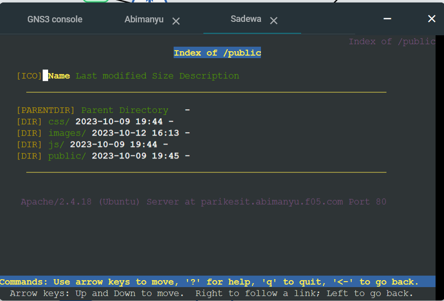

# Jarkom-Modul-2-F05-2023
Apta Rasendriya Wijaya - 5025211139

Made Nanda Wija Vahindra - 5025211160

### soal 1.
Pada soal diminta membuat topologi dan konfigurasinya dimana pada kelompok kami mendapatkan topologi ke 5 dan berikur topologi yang kami buat


dengan konfiguransi sebagai berikut

Pandudewanata:
```
auto eth0
iface eth0 inet dhcp

auto eth1
iface eth1 inet static
    address 10.54.1.1
    netmask 255.255.255.0

auto eth2
iface eth2 inet static
    address 10.54.2.1
    netmask 255.255.255.0

auto eth3
iface eth3 inet static
    address 10.54.3.1
    netmask 255.255.255.0
```
Nakula:
```
auto eth0
iface eth0 inet static
    address 10.54.1.2
    netmask 255.255.255.0
    gateway 10.54.1.1
```

Sadewa:
```
auto eth0
iface eth0 inet static
    address 10.54.1.3
    netmask 255.255.255.0
    gateway 10.54.1.1
```

Yudistira:
```
auto eth0
iface eth0 inet static
    address 10.54.2.2
    netmask 255.255.255.0
    gateway 10.54.2.1
```

Werkudara:
```
auto eth0
iface eth0 inet static
    address 10.54.2.3
    netmask 255.255.255.0
    gateway 10.54.2.1
```

Arjuna:
```
auto eth0
iface eth0 inet static
    address 10.54.3.2
    netmask 255.255.255.0
    gateway 10.54.3.1
```

Wisanggeni:
```
auto eth0
iface eth0 inet static
    address 10.54.3.3
    netmask 255.255.255.0
    gateway 10.54.3.1
```

Abimanyu:
```
auto eth0
iface eth0 inet static
    address 10.54.3.4
    netmask 255.255.255.0
    gateway 10.54.3.1
```

Prabukusuma:
```
auto eth0
iface eth0 inet static
    address 10.54.3.5
    netmask 255.255.255.0
    gateway 10.54.3.1
```

### soal 2.
Pada soal diminta membuat DNS node arjuna yaitu arjuna.f05.com dengan alias www.arjuna.f05.com pada node yudhistira, untuk melakukan konfigurasi tersebut hanya dengan run script berikut di yudhistira:

```
#!/bin/bash
echo 'nameserver 192.168.122.1' > /etc/resolv.conf

apt-get update

apt-get install bind9 -y

echo 'zone "arjuna.f05.com" {' > /etc/bind/named.conf.local
echo '    type master;' >> /etc/bind/named.conf.local
echo '    file "/etc/bind/jarkom/arjuna.f05.com";' >> /etc/bind/named.conf.local
echo '};' >> /etc/bind/named.conf.local

mkdir /etc/bind/jarkom

cp /etc/bind/db.local /etc/bind/jarkom/arjuna.f05.com

echo ';' > /etc/bind/jarkom/arjuna.f05.com
echo '; BIND data file for local loopback interface' >> /etc/bind/jarkom/arjuna.f05.com
echo ';' >> /etc/bind/jarkom/arjuna.f05.com
echo '$TTL    604800' >> /etc/bind/jarkom/arjuna.f05.com
echo '@       IN      SOA     arjuna.f05.com. root.arjuna.f05.com. (' >> /etc/bind/jarkom/arjuna.f05.com
echo '                              2         ; Serial' >> /etc/bind/jarkom/arjuna.f05.com
echo '                         604800         ; Refresh' >> /etc/bind/jarkom/arjuna.f05.com
echo '                          86400         ; Retry' >> /etc/bind/jarkom/arjuna.f05.com
echo '                        2419200         ; Expire' >> /etc/bind/jarkom/arjuna.f05.com
echo '                         604800 )       ; Negative Cache TTL' >> /etc/bind/jarkom/arjuna.f05.com
echo ';' >> /etc/bind/jarkom/arjuna.f05.com
echo '@       IN      NS      arjuna.f05.com.' >> /etc/bind/jarkom/arjuna.f05.com
echo '@       IN      A       10.54.3.2' >> /etc/bind/jarkom/arjuna.f05.com
echo 'www     IN      CNAME   arjuna.f05.com.' >> /etc/bind/jarkom/arjuna.f05.com

service bind9 restart
```
dimana untuk mengeset namaserver menggunamakan NS, CNAME untuk aliasnya, A untuk mengarahkan IP DNS ke arjuna. Untuk melakukan pengecekan bahwa konfigurasi benar atau salah kita perlu mengatur konfigurasi pada node dengan menjalankan script berikut:
```
echo 'nameserver 10.54.2.2 #Yudistira' > /etc/resolv.conf
```
```
ping arjuna.f05.com -c 4
ping www.arjuna.f05.com -c 4
```
Hasil:


### soal 3.
Pada soal diminta membuat DNS node arjuna yaitu abimanyu.f05.com dengan alias www.abimanyu.f05.com pada node yudhistira, untuk melakukan konfigurasi tersebut hanya dengan run script berikut:

```
#!/bin/bash
echo 'nameserver 192.168.122.1' > /etc/resolv.conf

apt-get update

apt-get install bind9 -y

echo 'zone "arjuna.f05.com" {' > /etc/bind/named.conf.local
echo '    type master;' >> /etc/bind/named.conf.local
echo '    file "/etc/bind/jarkom/arjuna.f05.com";' >> /etc/bind/named.conf.local
echo '};' >> /etc/bind/named.conf.local

echo 'zone "abimanyu.f05.com" {' >> /etc/bind/named.conf.local
echo '    type master;' >> /etc/bind/named.conf.local
echo '    file "/etc/bind/jarkom/abimanyu.f05.com";' >> /etc/bind/named.conf.local
echo '};' >> /etc/bind/named.conf.local

mkdir /etc/bind/jarkom

cp /etc/bind/db.local /etc/bind/jarkom/arjuna.f05.com

echo ';' > /etc/bind/jarkom/arjuna.f05.com
echo '; BIND data file for local loopback interface' >> /etc/bind/jarkom/arjuna.f05.com
echo ';' >> /etc/bind/jarkom/arjuna.f05.com
echo '$TTL    604800' >> /etc/bind/jarkom/arjuna.f05.com
echo '@       IN      SOA     arjuna.f05.com. root.arjuna.f05.com. (' >> /etc/bind/jarkom/arjuna.f05.com
echo '                              2         ; Serial' >> /etc/bind/jarkom/arjuna.f05.com
echo '                         604800         ; Refresh' >> /etc/bind/jarkom/arjuna.f05.com
echo '                          86400         ; Retry' >> /etc/bind/jarkom/arjuna.f05.com
echo '                        2419200         ; Expire' >> /etc/bind/jarkom/arjuna.f05.com
echo '                         604800 )       ; Negative Cache TTL' >> /etc/bind/jarkom/arjuna.f05.com
echo ';' >> /etc/bind/jarkom/arjuna.f05.com
echo '@       IN      NS      arjuna.f05.com.' >> /etc/bind/jarkom/arjuna.f05.com
echo '@       IN      A       10.54.3.2' >> /etc/bind/jarkom/arjuna.f05.com
echo 'www     IN      CNAME   arjuna.f05.com.' >> /etc/bind/jarkom/arjuna.f05.com

echo ';' > /etc/bind/jarkom/abimanyu.f05.com
echo '; BIND data file for local loopback interface' >> /etc/bind/jarkom/abimanyu.f05.com
echo ';' >> /etc/bind/jarkom/abimanyu.f05.com
echo '$TTL    604800' >> /etc/bind/jarkom/abimanyu.f05.com
echo '@       IN      SOA     abimanyu.f05.com. root.abimanyu.f05.com. (' >> /etc/bind/jarkom/abimanyu.f05.com
echo '                              2         ; Serial' >> /etc/bind/jarkom/abimanyu.f05.com
echo '                         604800         ; Refresh' >> /etc/bind/jarkom/abimanyu.f05.com
echo '                          86400         ; Retry' >> /etc/bind/jarkom/abimanyu.f05.com
echo '                        2419200         ; Expire' >> /etc/bind/jarkom/abimanyu.f05.com
echo '                         604800 )       ; Negative Cache TTL' >> /etc/bind/jarkom/abimanyu.f05.com
echo ';' >> /etc/bind/jarkom/abimanyu.f05.com
echo '@       IN      NS      abimanyu.f05.com.' >> /etc/bind/jarkom/abimanyu.f05.com
echo '@       IN      A       10.54.3.4' >> /etc/bind/jarkom/abimanyu.f05.com
echo 'www     IN      CNAME   abimanyu.f05.com.' >> /etc/bind/jarkom/abimanyu.f05.com

service bind9 restart
```
dimana untuk mengeset namaserver menggunamakan NS, CNAME untuk aliasnya, A untuk mengarahkan IP DNS ke abimanyu. Untuk melakukan pengecekan bahwa konfigurasi benar atau salah kita perlu mengatur konfigurasi pada node dengan menjalankan script berikut:
```
echo 'nameserver 10.54.2.2 #Yudistira' > /etc/resolv.conf
```
```
ping abimanyu.f05.com -c 5
ping ping www.abimanyu.f05.com -c 5
```
Hasil:


### soal 4.
Pada soal diminta membuat subdomain parikesit.abimanyu.f05.com pada node yudhistira, untuk melakukan konfigurasi tersebut hanya dengan run script berikut:
```
#!/bin/bash
echo 'nameserver 192.168.122.1' > /etc/resolv.conf

apt-get update

apt-get install bind9 -y

echo 'zone "arjuna.f05.com" {' > /etc/bind/named.conf.local
echo '    type master;' >> /etc/bind/named.conf.local
echo '    file "/etc/bind/jarkom/arjuna.f05.com";' >> /etc/bind/named.conf.local
echo '};' >> /etc/bind/named.conf.local

echo 'zone "abimanyu.f05.com" {' >> /etc/bind/named.conf.local
echo '    type master;' >> /etc/bind/named.conf.local
echo '    file "/etc/bind/jarkom/abimanyu.f05.com";' >> /etc/bind/named.conf.local
echo '};' >> /etc/bind/named.conf.local

mkdir /etc/bind/jarkom

cp /etc/bind/db.local /etc/bind/jarkom/arjuna.f05.com

echo ';' > /etc/bind/jarkom/arjuna.f05.com
echo '; BIND data file for local loopback interface' >> /etc/bind/jarkom/arjuna.f05.com
echo ';' >> /etc/bind/jarkom/arjuna.f05.com
echo '$TTL    604800' >> /etc/bind/jarkom/arjuna.f05.com
echo '@       IN      SOA     arjuna.f05.com. root.arjuna.f05.com. (' >> /etc/bind/jarkom/arjuna.f05.com
echo '                              2         ; Serial' >> /etc/bind/jarkom/arjuna.f05.com
echo '                         604800         ; Refresh' >> /etc/bind/jarkom/arjuna.f05.com
echo '                          86400         ; Retry' >> /etc/bind/jarkom/arjuna.f05.com
echo '                        2419200         ; Expire' >> /etc/bind/jarkom/arjuna.f05.com
echo '                         604800 )       ; Negative Cache TTL' >> /etc/bind/jarkom/arjuna.f05.com
echo ';' >> /etc/bind/jarkom/arjuna.f05.com
echo '@       IN      NS      arjuna.f05.com.' >> /etc/bind/jarkom/arjuna.f05.com
echo '@       IN      A       10.54.3.2' >> /etc/bind/jarkom/arjuna.f05.com
echo 'www     IN      CNAME   arjuna.f05.com.' >> /etc/bind/jarkom/arjuna.f05.com

echo ';' > /etc/bind/jarkom/abimanyu.f05.com
echo '; BIND data file for local loopback interface' >> /etc/bind/jarkom/abimanyu.f05.com
echo ';' >> /etc/bind/jarkom/abimanyu.f05.com
echo '$TTL    604800' >> /etc/bind/jarkom/abimanyu.f05.com
echo '@       IN      SOA     abimanyu.f05.com. root.abimanyu.f05.com. (' >> /etc/bind/jarkom/abimanyu.f05.com
echo '                              2         ; Serial' >> /etc/bind/jarkom/abimanyu.f05.com
echo '                         604800         ; Refresh' >> /etc/bind/jarkom/abimanyu.f05.com
echo '                          86400         ; Retry' >> /etc/bind/jarkom/abimanyu.f05.com
echo '                        2419200         ; Expire' >> /etc/bind/jarkom/abimanyu.f05.com
echo '                         604800 )       ; Negative Cache TTL' >> /etc/bind/jarkom/abimanyu.f05.com
echo ';' >> /etc/bind/jarkom/abimanyu.f05.com
echo '@         IN      NS      abimanyu.f05.com.' >> /etc/bind/jarkom/abimanyu.f05.com
echo '@         IN      A       10.54.3.4' >> /etc/bind/jarkom/abimanyu.f05.com
echo 'www       IN      CNAME   abimanyu.f05.com.' >> /etc/bind/jarkom/abimanyu.f05.com
echo 'parikesit IN      A       10.54.3.4' >> /etc/bind/jarkom/abimanyu.f05.com

service bind9 restart
```
dimana untuk mengeset subdomain hanya menggunakan A yang di set ke IP dari domain utama. Untuk melakukan pengecekan bahwa konfigurasi benar atau salah kita perlu mengatur konfigurasi pada node dengan menjalankan script berikut:
```
echo 'nameserver 10.54.2.2 #Yudistira' > /etc/resolv.conf
```
```
ping parikesit.abimanyu.f05.com -c 4
```
Hasil:


### soal 5.
Pada soal diminta membuat reverse DNS dari abimanyu, untuk melakukan konfigurasi tersebut hanya dengan run script berikut:
```
#!/bin/bash
echo 'nameserver 192.168.122.1' > /etc/resolv.conf

apt-get update

apt-get install bind9 -y

echo 'zone "arjuna.f05.com" {' > /etc/bind/named.conf.local
echo '    type master;' >> /etc/bind/named.conf.local
echo '    file "/etc/bind/jarkom/arjuna.f05.com";' >> /etc/bind/named.conf.local
echo '};' >> /etc/bind/named.conf.local

echo 'zone "abimanyu.f05.com" {' >> /etc/bind/named.conf.local
echo '    type master;' >> /etc/bind/named.conf.local
echo '    file "/etc/bind/jarkom/abimanyu.f05.com";' >> /etc/bind/named.conf.local
echo '};' >> /etc/bind/named.conf.local

echo 'zone "3.54.10.in-addr.arpa" {' >> /etc/bind/named.conf.local
echo '    type master;' >> /etc/bind/named.conf.local
echo '    file "/etc/bind/jarkom/3.54.10.in-addr.arpa";' >> /etc/bind/named.conf.local
echo '};' >> /etc/bind/named.conf.local

mkdir /etc/bind/jarkom

cp /etc/bind/db.local /etc/bind/jarkom/arjuna.f05.com

echo ';' > /etc/bind/jarkom/arjuna.f05.com
echo '; BIND data file for local loopback interface' >> /etc/bind/jarkom/arjuna.f05.com
echo ';' >> /etc/bind/jarkom/arjuna.f05.com
echo '$TTL    604800' >> /etc/bind/jarkom/arjuna.f05.com
echo '@       IN      SOA     arjuna.f05.com. root.arjuna.f05.com. (' >> /etc/bind/jarkom/arjuna.f05.com
echo '                              2         ; Serial' >> /etc/bind/jarkom/arjuna.f05.com
echo '                         604800         ; Refresh' >> /etc/bind/jarkom/arjuna.f05.com
echo '                          86400         ; Retry' >> /etc/bind/jarkom/arjuna.f05.com
echo '                        2419200         ; Expire' >> /etc/bind/jarkom/arjuna.f05.com
echo '                         604800 )       ; Negative Cache TTL' >> /etc/bind/jarkom/arjuna.f05.com
echo ';' >> /etc/bind/jarkom/arjuna.f05.com
echo '@       IN      NS      arjuna.f05.com.' >> /etc/bind/jarkom/arjuna.f05.com
echo '@       IN      A       10.54.3.2' >> /etc/bind/jarkom/arjuna.f05.com
echo 'www     IN      CNAME   arjuna.f05.com.' >> /etc/bind/jarkom/arjuna.f05.com
echo '@       IN      AAAA    ::1' >> /etc/bind/jarkom/arjuna.f05.com

echo ';' > /etc/bind/jarkom/abimanyu.f05.com
echo '; BIND data file for local loopback interface' >> /etc/bind/jarkom/abimanyu.f05.com
echo ';' >> /etc/bind/jarkom/abimanyu.f05.com
echo '$TTL    604800' >> /etc/bind/jarkom/abimanyu.f05.com
echo '@       IN      SOA     abimanyu.f05.com. root.abimanyu.f05.com. (' >> /etc/bind/jarkom/abimanyu.f05.com
echo '                              2         ; Serial' >> /etc/bind/jarkom/abimanyu.f05.com
echo '                         604800         ; Refresh' >> /etc/bind/jarkom/abimanyu.f05.com
echo '                          86400         ; Retry' >> /etc/bind/jarkom/abimanyu.f05.com
echo '                        2419200         ; Expire' >> /etc/bind/jarkom/abimanyu.f05.com
echo '                         604800 )       ; Negative Cache TTL' >> /etc/bind/jarkom/abimanyu.f05.com
echo ';' >> /etc/bind/jarkom/abimanyu.f05.com
echo '@         IN      NS      abimanyu.f05.com.' >> /etc/bind/jarkom/abimanyu.f05.com
echo '@         IN      A       10.54.3.4' >> /etc/bind/jarkom/abimanyu.f05.com
echo 'www       IN      CNAME   abimanyu.f05.com.' >> /etc/bind/jarkom/abimanyu.f05.com
echo 'parikesit IN      A       10.54.3.4' >> /etc/bind/jarkom/abimanyu.f05.com
echo '@         IN      AAAA    ::1' >> /etc/bind/jarkom/abimanyu.f05.com

cp /etc/bind/db.local /etc/bind/jarkom/3.54.10.in-addr.arpa

echo ';' > /etc/bind/jarkom/3.54.10.in-addr.arpa
echo '; BIND data file for local loopback interface' >> /etc/bind/jarkom/3.54.10.in-addr.arpa
echo ';' >> /etc/bind/jarkom/3.54.10.in-addr.arpa
echo '$TTL    604800' >> /etc/bind/jarkom/3.54.10.in-addr.arpa
echo '@       IN      SOA     arjuna.f05.com. root.arjuna.f05.com. (' >> /etc/bind/jarkom/3.54.10.in-addr.arpa
echo '                              2         ; Serial' >> /etc/bind/jarkom/3.54.10.in-addr.arpa
echo '                         604800         ; Refresh' >> /etc/bind/jarkom/3.54.10.in-addr.arpa
echo '                          86400         ; Retry' >> /etc/bind/jarkom/3.54.10.in-addr.arpa
echo '                        2419200         ; Expire' >> /etc/bind/jarkom/3.54.10.in-addr.arpa
echo '                         604800 )       ; Negative Cache TTL' >> /etc/bind/jarkom/3.54.10.in-addr.arpa
echo ';' >> /etc/bind/jarkom/3.54.10.in-addr.arpa
echo '3.54.10.in-addr.arpa. IN      NS      abimanyu.f05.com.' >> /etc/bind/jarkom/3.54.10.in-addr.arpa
echo '4                     IN      PTR     abimanyu.f05.com. ; Byte ke-4 Yudistira' >> /etc/bind/jarkom/3.54.10.in-addr.arpa

service bind9 restart
```
dimana untuk mengeset reverse DNS menambahkan konfigurasi baru seperti script diatas. Untuk melakukan pengecekan bahwa konfigurasi benar atau salah kita perlu mengatur konfigurasi pada node dengan menjalankan script berikut:
```
echo 'nameserver 192.168.122.1' > /etc/resolv.conf
apt-get update
apt-get install dnsutils -y
echo 'nameserver 10.54.2.2' > /etc/resolv.conf
```
```
host -t PTR 10.54.3.4
```
Hasil:


### soal 6.
Pada soal diminta membuat DNS slave dari abimanyu dan arjuna, untuk melakukan konfigurasi tersebut hanya dengan run script berikut:

yudhistira:
```
#!/bin/bash
echo 'nameserver 192.168.122.1' > /etc/resolv.conf

apt-get update

apt-get install bind9 -y

echo 'zone "arjuna.f05.com" {' > /etc/bind/named.conf.local
echo '    type master;' >> /etc/bind/named.conf.local
echo '    notify yes;' >> /etc/bind/named.conf.local
echo '    also-notify { 10.54.2.3; }; // Masukan IP Werkudara tanpa tanda petik' >> /etc/bind/named.conf.local
echo '    allow-transfer { 10.54.2.3; }; // Masukan IP Werkudara tanpa tanda petik' >> /etc/bind/named.conf.local
echo '    file "/etc/bind/jarkom/arjuna.f05.com";' >> /etc/bind/named.conf.local
echo '};' >> /etc/bind/named.conf.local

echo 'zone "abimanyu.f05.com" {' >> /etc/bind/named.conf.local
echo '    type master;' >> /etc/bind/named.conf.local
echo '    notify yes;' >> /etc/bind/named.conf.local
echo '    also-notify { 10.54.2.3; }; // Masukan IP Werkudara tanpa tanda petik' >> /etc/bind/named.conf.local
echo '    allow-transfer { 10.54.2.3; }; // Masukan IP Werkudara tanpa tanda petik' >> /etc/bind/named.conf.local
echo '    file "/etc/bind/jarkom/abimanyu.f05.com";' >> /etc/bind/named.conf.local
echo '};' >> /etc/bind/named.conf.local

echo 'zone "3.54.10.in-addr.arpa" {' >> /etc/bind/named.conf.local
echo '    type master;' >> /etc/bind/named.conf.local
echo '    file "/etc/bind/jarkom/3.54.10.in-addr.arpa";' >> /etc/bind/named.conf.local
echo '};' >> /etc/bind/named.conf.local

mkdir /etc/bind/jarkom

cp /etc/bind/db.local /etc/bind/jarkom/arjuna.f05.com

echo ';' > /etc/bind/jarkom/arjuna.f05.com
echo '; BIND data file for local loopback interface' >> /etc/bind/jarkom/arjuna.f05.com
echo ';' >> /etc/bind/jarkom/arjuna.f05.com
echo '$TTL    604800' >> /etc/bind/jarkom/arjuna.f05.com
echo '@       IN      SOA     arjuna.f05.com. root.arjuna.f05.com. (' >> /etc/bind/jarkom/arjuna.f05.com
echo '                              2         ; Serial' >> /etc/bind/jarkom/arjuna.f05.com
echo '                         604800         ; Refresh' >> /etc/bind/jarkom/arjuna.f05.com
echo '                          86400         ; Retry' >> /etc/bind/jarkom/arjuna.f05.com
echo '                        2419200         ; Expire' >> /etc/bind/jarkom/arjuna.f05.com
echo '                         604800 )       ; Negative Cache TTL' >> /etc/bind/jarkom/arjuna.f05.com
echo ';' >> /etc/bind/jarkom/arjuna.f05.com
echo '@       IN      NS      arjuna.f05.com.' >> /etc/bind/jarkom/arjuna.f05.com
echo '@       IN      A       10.54.3.2' >> /etc/bind/jarkom/arjuna.f05.com
echo 'www     IN      CNAME   arjuna.f05.com.' >> /etc/bind/jarkom/arjuna.f05.com
echo '@       IN      AAAA    ::1' >> /etc/bind/jarkom/arjuna.f05.com

echo ';' > /etc/bind/jarkom/abimanyu.f05.com
echo '; BIND data file for local loopback interface' >> /etc/bind/jarkom/abimanyu.f05.com
echo ';' >> /etc/bind/jarkom/abimanyu.f05.com
echo '$TTL    604800' >> /etc/bind/jarkom/abimanyu.f05.com
echo '@       IN      SOA     abimanyu.f05.com. root.abimanyu.f05.com. (' >> /etc/bind/jarkom/abimanyu.f05.com
echo '                              2         ; Serial' >> /etc/bind/jarkom/abimanyu.f05.com
echo '                         604800         ; Refresh' >> /etc/bind/jarkom/abimanyu.f05.com
echo '                          86400         ; Retry' >> /etc/bind/jarkom/abimanyu.f05.com
echo '                        2419200         ; Expire' >> /etc/bind/jarkom/abimanyu.f05.com
echo '                         604800 )       ; Negative Cache TTL' >> /etc/bind/jarkom/abimanyu.f05.com
echo ';' >> /etc/bind/jarkom/abimanyu.f05.com
echo '@         IN      NS      abimanyu.f05.com.' >> /etc/bind/jarkom/abimanyu.f05.com
echo '@         IN      A       10.54.3.4' >> /etc/bind/jarkom/abimanyu.f05.com
echo 'www       IN      CNAME   abimanyu.f05.com.' >> /etc/bind/jarkom/abimanyu.f05.com
echo 'parikesit IN      A       10.54.3.4' >> /etc/bind/jarkom/abimanyu.f05.com
echo '@         IN      AAAA    ::1' >> /etc/bind/jarkom/abimanyu.f05.com

cp /etc/bind/db.local /etc/bind/jarkom/3.54.10.in-addr.arpa

echo ';' > /etc/bind/jarkom/3.54.10.in-addr.arpa
echo '; BIND data file for local loopback interface' >> /etc/bind/jarkom/3.54.10.in-addr.arpa
echo ';' >> /etc/bind/jarkom/3.54.10.in-addr.arpa
echo '$TTL    604800' >> /etc/bind/jarkom/3.54.10.in-addr.arpa
echo '@       IN      SOA     arjuna.f05.com. root.arjuna.f05.com. (' >> /etc/bind/jarkom/3.54.10.in-addr.arpa
echo '                              2         ; Serial' >> /etc/bind/jarkom/3.54.10.in-addr.arpa
echo '                         604800         ; Refresh' >> /etc/bind/jarkom/3.54.10.in-addr.arpa
echo '                          86400         ; Retry' >> /etc/bind/jarkom/3.54.10.in-addr.arpa
echo '                        2419200         ; Expire' >> /etc/bind/jarkom/3.54.10.in-addr.arpa
echo '                         604800 )       ; Negative Cache TTL' >> /etc/bind/jarkom/3.54.10.in-addr.arpa
echo ';' >> /etc/bind/jarkom/3.54.10.in-addr.arpa
echo '3.54.10.in-addr.arpa. IN      NS      abimanyu.f05.com.' >> /etc/bind/jarkom/3.54.10.in-addr.arpa
echo '4                     IN      PTR     abimanyu.f05.com. ; Byte ke-4 Yudistira' >> /etc/bind/jarkom/3.54.10.in-addr.arpa

service bind9 restart
```

werkudara:

```
#!/bin/bash

echo 'nameserver 192.168.122.1' > /etc/resolv.conf

apt-get update

apt-get install bind9 -y

echo 'zone "arjuna.f05.com" {' > /etc/bind/named.conf.local
echo '    type slave;' >> /etc/bind/named.conf.local
echo '    masters { 10.54.2.2; }; // Masukan IP Yudistira tanpa tanda petik' >> /etc/bind/named.conf.local
echo '    file "/etc/bind/jarkom/arjuna.f05.com";' >> /etc/bind/named.conf.local
echo '};' >> /etc/bind/named.conf.local


echo 'zone "abimanyu.f05.com" {' >> /etc/bind/named.conf.local
echo '    type slave;' >> /etc/bind/named.conf.local
echo '    masters { 10.54.2.2; }; // Masukan IP Yudistira tanpa tanda petik' >> /etc/bind/named.conf.local
echo '    file "/etc/bind/jarkom/abimanyu.f05.com";' >> /etc/bind/named.conf.local
echo '};' >> /etc/bind/named.conf.local

service bind9 restart
```

dimana untuk mengeset DNS slave adalah dengan mengatur also-notify dan allow-transfer pada DNS arjuna dan abimanyu yang mengarah ke IP werkudara lalu untuk werkudara di set type slave dan masternya yudhistira. Untuk melakukan pengecekan bahwa konfigurasi benar atau salah kita perlu mengatur konfigurasi pada node dengan menjalankan script berikut:

stop bind9 pada yudhistira:
```
service bind9 stop
```
kemudian untuk mengecek jangan lupa set resolve.confnya dengan API Yudistira dan Werkudara
```
echo 'nameserver 10.54.2.2 #Yudistira' > /etc/resolv.conf
echo 'nameserver 10.54.2.3 #Werkudara' >> /etc/resolv.conf
service bind9 stop
ping arjuna.f05.com -c 4
ping abimanyu.f05.com -c 4
```
Hasil:


### soal 7.
Pada soal diminta membuat subdomain khusu yaitu  baratayuda.abimanyu.f05.com dengan alias www.baratayuda.abimanyu.f05.com yang didelegasikan dari Yudhistira ke Werkudara dengan IP menuju ke Abimanyu dalam folder Baratayuda, untuk melakukan konfigurasi tersebut hanya dengan run script berikut:

yudhistira:
```
#!/bin/bash
echo 'nameserver 192.168.122.1' > /etc/resolv.conf

apt-get update

apt-get install bind9 -y

echo 'zone "arjuna.f05.com" {' > /etc/bind/named.conf.local
echo '    type master;' >> /etc/bind/named.conf.local
echo '    notify yes;' >> /etc/bind/named.conf.local
echo '    also-notify { 10.54.2.3; }; // Masukan IP Werkudara tanpa tanda petik' >> /etc/bind/named.conf.local
echo '    allow-transfer { 10.54.2.3; }; // Masukan IP Werkudara tanpa tanda petik' >> /etc/bind/named.conf.local
echo '    file "/etc/bind/jarkom/arjuna.f05.com";' >> /etc/bind/named.conf.local
echo '};' >> /etc/bind/named.conf.local

echo 'zone "abimanyu.f05.com" {' >> /etc/bind/named.conf.local
echo '    type master;' >> /etc/bind/named.conf.local
echo '    allow-transfer { 10.54.2.3; }; // Masukan IP Werkudara tanpa tanda petik' >> /etc/bind/named.conf.local
echo '    file "/etc/bind/jarkom/abimanyu.f05.com";' >> /etc/bind/named.conf.local
echo '};' >> /etc/bind/named.conf.local

echo 'zone "3.54.10.in-addr.arpa" {' >> /etc/bind/named.conf.local
echo '    type master;' >> /etc/bind/named.conf.local
echo '    file "/etc/bind/jarkom/3.54.10.in-addr.arpa";' >> /etc/bind/named.conf.local
echo '};' >> /etc/bind/named.conf.local

mkdir /etc/bind/jarkom

cp /etc/bind/db.local /etc/bind/jarkom/arjuna.f05.com

echo ';' > /etc/bind/jarkom/arjuna.f05.com
echo '; BIND data file for local loopback interface' >> /etc/bind/jarkom/arjuna.f05.com
echo ';' >> /etc/bind/jarkom/arjuna.f05.com
echo '$TTL    604800' >> /etc/bind/jarkom/arjuna.f05.com
echo '@       IN      SOA     arjuna.f05.com. root.arjuna.f05.com. (' >> /etc/bind/jarkom/arjuna.f05.com
echo '                              2         ; Serial' >> /etc/bind/jarkom/arjuna.f05.com
echo '                         604800         ; Refresh' >> /etc/bind/jarkom/arjuna.f05.com
echo '                          86400         ; Retry' >> /etc/bind/jarkom/arjuna.f05.com
echo '                        2419200         ; Expire' >> /etc/bind/jarkom/arjuna.f05.com
echo '                         604800 )       ; Negative Cache TTL' >> /etc/bind/jarkom/arjuna.f05.com
echo ';' >> /etc/bind/jarkom/arjuna.f05.com
echo '@       IN      NS      arjuna.f05.com.' >> /etc/bind/jarkom/arjuna.f05.com
echo '@       IN      A       10.54.3.2' >> /etc/bind/jarkom/arjuna.f05.com
echo 'www     IN      CNAME   arjuna.f05.com.' >> /etc/bind/jarkom/arjuna.f05.com
echo '@       IN      AAAA    ::1' >> /etc/bind/jarkom/arjuna.f05.com

echo ';' > /etc/bind/jarkom/abimanyu.f05.com
echo '; BIND data file for local loopback interface' >> /etc/bind/jarkom/abimanyu.f05.com
echo ';' >> /etc/bind/jarkom/abimanyu.f05.com
echo '$TTL    604800' >> /etc/bind/jarkom/abimanyu.f05.com
echo '@       IN      SOA     abimanyu.f05.com. root.abimanyu.f05.com. (' >> /etc/bind/jarkom/abimanyu.f05.com
echo '                              2         ; Serial' >> /etc/bind/jarkom/abimanyu.f05.com
echo '                         604800         ; Refresh' >> /etc/bind/jarkom/abimanyu.f05.com
echo '                          86400         ; Retry' >> /etc/bind/jarkom/abimanyu.f05.com
echo '                        2419200         ; Expire' >> /etc/bind/jarkom/abimanyu.f05.com
echo '                         604800 )       ; Negative Cache TTL' >> /etc/bind/jarkom/abimanyu.f05.com
echo ';' >> /etc/bind/jarkom/abimanyu.f05.com
echo '@          IN      NS      abimanyu.f05.com.' >> /etc/bind/jarkom/abimanyu.f05.com
echo '@          IN      A       10.54.3.4' >> /etc/bind/jarkom/abimanyu.f05.com
echo 'www        IN      CNAME   abimanyu.f05.com.' >> /etc/bind/jarkom/abimanyu.f05.com
echo 'parikesit  IN      A       10.54.3.4' >> /etc/bind/jarkom/abimanyu.f05.com
echo 'ns1        IN      A       10.54.2.3' >> /etc/bind/jarkom/abimanyu.f05.com
echo 'baratayuda IN      NS      ns1' >> /etc/bind/jarkom/abimanyu.f05.com

cp /etc/bind/db.local /etc/bind/jarkom/3.54.10.in-addr.arpa

echo ';' > /etc/bind/jarkom/3.54.10.in-addr.arpa
echo '; BIND data file for local loopback interface' >> /etc/bind/jarkom/3.54.10.in-addr.arpa
echo ';' >> /etc/bind/jarkom/3.54.10.in-addr.arpa
echo '$TTL    604800' >> /etc/bind/jarkom/3.54.10.in-addr.arpa
echo '@       IN      SOA     arjuna.f05.com. root.arjuna.f05.com. (' >> /etc/bind/jarkom/3.54.10.in-addr.arpa
echo '                              2         ; Serial' >> /etc/bind/jarkom/3.54.10.in-addr.arpa
echo '                         604800         ; Refresh' >> /etc/bind/jarkom/3.54.10.in-addr.arpa
echo '                          86400         ; Retry' >> /etc/bind/jarkom/3.54.10.in-addr.arpa
echo '                        2419200         ; Expire' >> /etc/bind/jarkom/3.54.10.in-addr.arpa
echo '                         604800 )       ; Negative Cache TTL' >> /etc/bind/jarkom/3.54.10.in-addr.arpa
echo ';' >> /etc/bind/jarkom/3.54.10.in-addr.arpa
echo '3.54.10.in-addr.arpa. IN      NS      abimanyu.f05.com.' >> /etc/bind/jarkom/3.54.10.in-addr.arpa
echo '4                     IN      PTR     abimanyu.f05.com. ; Byte ke-4 Yudistira' >> /etc/bind/jarkom/3.54.10.in-addr.arpa

echo "options {
        directory \"/var/cache/bind\";

        // If there is a firewall between you and nameservers you want
        // to talk to, you may need to fix the firewall to allow multiple
        // ports to talk.  See http://www.kb.cert.org/vuls/id/800113

        // If your ISP provided one or more IP addresses for stable
        // nameservers, you probably want to use them as forwarders.
        // Uncomment the following block, and insert the addresses replacing
        // the all-0's placeholder.

        // forwarders {
        //      0.0.0.0;
        // };

        //=====================================================================$
        // If BIND logs error messages about the root key being expired,
        // you will need to update your keys.  See https://www.isc.org/bind-keys
        //=====================================================================$
        //dnssec-validation auto;
        allow-query{any;};

        auth-nxdomain no;    # conform to RFC1035
        listen-on-v6 { any; };
};" > /etc/bind/named.conf.options

service bind9 restart
```

werkudara:

```
#!/bin/bash

echo 'nameserver 192.168.122.1' > /etc/resolv.conf

apt-get update

apt-get install bind9 -y

echo 'zone "arjuna.f05.com" {' > /etc/bind/named.conf.local
echo '    type slave;' >> /etc/bind/named.conf.local
echo '    masters { 10.54.2.2; }; // Masukan IP Yudistira tanpa tanda petik' >> /etc/bind/named.conf.local
echo '    file "/etc/bind/jarkom/arjuna.f05.com";' >> /etc/bind/named.conf.local
echo '};' >> /etc/bind/named.conf.local

echo 'zone "abimanyu.f05.com" {' >> /etc/bind/named.conf.local
echo '    type slave;' >> /etc/bind/named.conf.local
echo '    masters { 10.54.2.2; }; // Masukan IP Yudistira tanpa tanda petik' >> /etc/bind/named.conf.local
echo '    file "/etc/bind/jarkom/abimanyu.f05.com";' >> /etc/bind/named.conf.local
echo '};' >> /etc/bind/named.conf.local

echo 'zone "baratayuda.abimanyu.f05.com" {' >> /etc/bind/named.conf.local
echo '    type master;' >> /etc/bind/named.conf.local
echo '    file "/etc/bind/Baratayuda/baratayuda.abimanyu.f05.com";' >> /etc/bind/named.conf.local
echo '};' >> /etc/bind/named.conf.local

mkdir /etc/bind/Baratayuda
cp /etc/bind/db.local /etc/bind/Baratayuda/baratayuda.abimanyu.f05.com

echo ';' > /etc/bind/Baratayuda/baratayuda.abimanyu.f05.com
echo '; BIND data file for local loopback interface' >> /etc/bind/Baratayuda/baratayuda.abimanyu.f05.com
echo ';' >> /etc/bind/Baratayuda/baratayuda.abimanyu.f05.com
echo '$TTL    604800' >> /etc/bind/Baratayuda/baratayuda.abimanyu.f05.com
echo '@       IN      SOA     baratayuda.abimanyu.f05.com. root.baratayuda.abimanyu.f05.com. (' >> /etc/bind/Baratayuda/baratayuda.abimanyu.f05.com
echo '                        2022100601         ; Serial' >> /etc/bind/Baratayuda/baratayuda.abimanyu.f05.com
echo '                         604800         ; Refresh' >> /etc/bind/Baratayuda/baratayuda.abimanyu.f05.com
echo '                          86400         ; Retry' >> /etc/bind/Baratayuda/baratayuda.abimanyu.f05.com
echo '                        2419200         ; Expire' >> /etc/bind/Baratayuda/baratayuda.abimanyu.f05.com
echo '                         604800 )       ; Negative Cache TTL' >> /etc/bind/Baratayuda/baratayuda.abimanyu.f05.com
echo ';' >> /etc/bind/Baratayuda/baratayuda.abimanyu.f05.com
echo '@       IN      NS      baratayuda.abimanyu.f05.com.' >> /etc/bind/Baratayuda/baratayuda.abimanyu.f05.com
echo '@       IN      A       10.54.3.4' >> /etc/bind/Baratayuda/baratayuda.abimanyu.f05.com
echo 'www     IN      CNAME   baratayuda.abimanyu.f05.com.' >> /etc/bind/Baratayuda/baratayuda.abimanyu.f05.com


echo "options {
        directory \"/var/cache/bind\";

        // If there is a firewall between you and nameservers you want
        // to talk to, you may need to fix the firewall to allow multiple
        // ports to talk.  See http://www.kb.cert.org/vuls/id/800113

        // If your ISP provided one or more IP addresses for stable
        // nameservers, you probably want to use them as forwarders.
        // Uncomment the following block, and insert the addresses replacing
        // the all-0's placeholder.

        // forwarders {
        //      0.0.0.0;
        // };

        //=====================================================================$
        // If BIND logs error messages about the root key being expired,
        // you will need to update your keys.  See https://www.isc.org/bind-keys
        //=====================================================================$
        //dnssec-validation auto;
        allow-query{any;};

        auth-nxdomain no;    # conform to RFC1035
        listen-on-v6 { any; };
};" > /etc/bind/named.conf.options

service bind9 restart
```

dimana untuk mengeset subdomain sama seperti sebelumnya. Untuk melakukan pengecekan bahwa konfigurasi benar atau salah kita perlu mengatur konfigurasi pada node dengan menjalankan script berikut:

```
echo 'nameserver 10.54.2.2 #Yudistira' > /etc/resolv.conf
echo 'nameserver 10.54.2.3 #Werkudara' >> /etc/resolv.conf
```
```
ping baratayuda.abimanyu.f05.com -c 4
ping www.baratayuda.abimanyu.f05.com -c 4
```
Hasil:


### soal 8.
Pada soal diminta membuat subdomain khusu yaitu rjp.baratayuda.abimanyu.yyy.com dengan alias www.rjp.baratayuda.abimanyu.yyy.com yang mengarah ke Abimanyu yang di konfigurasi di werkurdara, untuk melakukan konfigurasi tersebut hanya dengan run script berikut:

werkudara:

```
#!/bin/bash

echo 'nameserver 192.168.122.1' > /etc/resolv.conf

apt-get update

apt-get install bind9 -y

echo 'zone "arjuna.f05.com" {' > /etc/bind/named.conf.local
echo '    type slave;' >> /etc/bind/named.conf.local
echo '    masters { 10.54.2.2; }; // Masukan IP Yudistira tanpa tanda petik' >> /etc/bind/named.conf.local
echo '    file "/etc/bind/jarkom/arjuna.f05.com";' >> /etc/bind/named.conf.local
echo '};' >> /etc/bind/named.conf.local

echo 'zone "abimanyu.f05.com" {' >> /etc/bind/named.conf.local
echo '    type slave;' >> /etc/bind/named.conf.local
echo '    masters { 10.54.2.2; }; // Masukan IP Yudistira tanpa tanda petik' >> /etc/bind/named.conf.local
echo '    file "/etc/bind/jarkom/abimanyu.f05.com";' >> /etc/bind/named.conf.local
echo '};' >> /etc/bind/named.conf.local

echo 'zone "baratayuda.abimanyu.f05.com" {' >> /etc/bind/named.conf.local
echo '    type master;' >> /etc/bind/named.conf.local
echo '    file "/etc/bind/Baratayuda/baratayuda.abimanyu.f05.com";' >> /etc/bind/named.conf.local
echo '};' >> /etc/bind/named.conf.local

mkdir /etc/bind/Baratayuda
cp /etc/bind/db.local /etc/bind/Baratayuda/baratayuda.abimanyu.f05.com

echo ';' > /etc/bind/Baratayuda/baratayuda.abimanyu.f05.com
echo '; BIND data file for local loopback interface' >> /etc/bind/Baratayuda/baratayuda.abimanyu.f05.com
echo ';' >> /etc/bind/Baratayuda/baratayuda.abimanyu.f05.com
echo '$TTL    604800' >> /etc/bind/Baratayuda/baratayuda.abimanyu.f05.com
echo '@       IN      SOA     baratayuda.abimanyu.f05.com. root.baratayuda.abimanyu.f05.com. (' >> /etc/bind/Baratayuda/baratayuda.abimanyu.f05.com
echo '                        2022100601         ; Serial' >> /etc/bind/Baratayuda/baratayuda.abimanyu.f05.com
echo '                         604800         ; Refresh' >> /etc/bind/Baratayuda/baratayuda.abimanyu.f05.com
echo '                          86400         ; Retry' >> /etc/bind/Baratayuda/baratayuda.abimanyu.f05.com
echo '                        2419200         ; Expire' >> /etc/bind/Baratayuda/baratayuda.abimanyu.f05.com
echo '                         604800 )       ; Negative Cache TTL' >> /etc/bind/Baratayuda/baratayuda.abimanyu.f05.com
echo ';' >> /etc/bind/Baratayuda/baratayuda.abimanyu.f05.com
echo '@       IN      NS      baratayuda.abimanyu.f05.com.' >> /etc/bind/Baratayuda/baratayuda.abimanyu.f05.com
echo '@       IN      A       10.54.3.4' >> /etc/bind/Baratayuda/baratayuda.abimanyu.f05.com
echo 'www     IN      CNAME   baratayuda.abimanyu.f05.com.' >> /etc/bind/Baratayuda/baratayuda.abimanyu.f05.com
echo 'rjp     IN      A       10.54.3.4' >> /etc/bind/Baratayuda/baratayuda.abimanyu.f05.com
echo 'www.rjp IN      CNAME   rjp.baratayuda.abimanyu.f05.com.' >> /etc/bind/Baratayuda/baratayuda.abimanyu.f05.com

service bind9 restart
```

dimana untuk mengeset subdomain sama seperti sebelumnya tetapi pada penggunaan alias harus berbeda nama dari www yaitu wwww.rjp, untuk melakukan pengecekan bahwa konfigurasi benar atau salah kita perlu mengatur konfigurasi pada node dengan menjalankan script berikut:
```
echo 'nameserver 10.54.2.2 #Yudistira' > /etc/resolv.conf
echo 'nameserver 10.54.2.3 #Werkudara' >> /etc/resolv.conf
ping www.rjp.baratayuda.abimanyu.f05.com -c 4
```
Hasil:


### soal 9 dan 10.
Pada soal diminta membuat load balancer pada node arjuna dan 3 worker pada node Prabakusuma, Abimanyu, dan Wisanggeni. untuk melakukan konfigurasi tersebut hanya dengan run script berikut:

yudhistira:
```
#!/bin/bash
echo 'nameserver 192.168.122.1' > /etc/resolv.conf

apt-get update

apt-get install bind9 -y

echo 'zone "arjuna.f05.com" {' > /etc/bind/named.conf.local
echo '    type master;' >> /etc/bind/named.conf.local
echo '    notify yes;' >> /etc/bind/named.conf.local
echo '    also-notify { 10.54.2.3; }; // Masukan IP Werkudara tanpa tanda petik' >> /etc/bind/named.conf.local
echo '    allow-transfer { 10.54.2.3; }; // Masukan IP Werkudara tanpa tanda petik' >> /etc/bind/named.conf.local
echo '    file "/etc/bind/jarkom/arjuna.f05.com";' >> /etc/bind/named.conf.local
echo '};' >> /etc/bind/named.conf.local

echo 'zone "abimanyu.f05.com" {' >> /etc/bind/named.conf.local
echo '    type master;' >> /etc/bind/named.conf.local
echo '    allow-transfer { 10.54.2.3; }; // Masukan IP Werkudara tanpa tanda petik' >> /etc/bind/named.conf.local
echo '    file "/etc/bind/jarkom/abimanyu.f05.com";' >> /etc/bind/named.conf.local
echo '};' >> /etc/bind/named.conf.local

echo 'zone "3.54.10.in-addr.arpa" {' >> /etc/bind/named.conf.local
echo '    type master;' >> /etc/bind/named.conf.local
echo '    file "/etc/bind/jarkom/3.54.10.in-addr.arpa";' >> /etc/bind/named.conf.local
echo '};' >> /etc/bind/named.conf.local

mkdir /etc/bind/jarkom

cp /etc/bind/db.local /etc/bind/jarkom/arjuna.f05.com

echo ';' > /etc/bind/jarkom/arjuna.f05.com
echo '; BIND data file for local loopback interface' >> /etc/bind/jarkom/arjuna.f05.com
echo ';' >> /etc/bind/jarkom/arjuna.f05.com
echo '$TTL    604800' >> /etc/bind/jarkom/arjuna.f05.com
echo '@       IN      SOA     arjuna.f05.com. root.arjuna.f05.com. (' >> /etc/bind/jarkom/arjuna.f05.com
echo '                              2         ; Serial' >> /etc/bind/jarkom/arjuna.f05.com
echo '                         604800         ; Refresh' >> /etc/bind/jarkom/arjuna.f05.com
echo '                          86400         ; Retry' >> /etc/bind/jarkom/arjuna.f05.com
echo '                        2419200         ; Expire' >> /etc/bind/jarkom/arjuna.f05.com
echo '                         604800 )       ; Negative Cache TTL' >> /etc/bind/jarkom/arjuna.f05.com
echo ';' >> /etc/bind/jarkom/arjuna.f05.com
echo '@       IN      NS      arjuna.f05.com.' >> /etc/bind/jarkom/arjuna.f05.com
echo '@       IN      A       10.54.3.2' >> /etc/bind/jarkom/arjuna.f05.com
echo 'www     IN      CNAME   arjuna.f05.com.' >> /etc/bind/jarkom/arjuna.f05.com
echo '@       IN      AAAA    ::1' >> /etc/bind/jarkom/arjuna.f05.com

echo ';' > /etc/bind/jarkom/abimanyu.f05.com
echo '; BIND data file for local loopback interface' >> /etc/bind/jarkom/abimanyu.f05.com
echo ';' >> /etc/bind/jarkom/abimanyu.f05.com
echo '$TTL    604800' >> /etc/bind/jarkom/abimanyu.f05.com
echo '@       IN      SOA     abimanyu.f05.com. root.abimanyu.f05.com. (' >> /etc/bind/jarkom/abimanyu.f05.com
echo '                              2         ; Serial' >> /etc/bind/jarkom/abimanyu.f05.com
echo '                         604800         ; Refresh' >> /etc/bind/jarkom/abimanyu.f05.com
echo '                          86400         ; Retry' >> /etc/bind/jarkom/abimanyu.f05.com
echo '                        2419200         ; Expire' >> /etc/bind/jarkom/abimanyu.f05.com
echo '                         604800 )       ; Negative Cache TTL' >> /etc/bind/jarkom/abimanyu.f05.com
echo ';' >> /etc/bind/jarkom/abimanyu.f05.com
echo '@          IN      NS      abimanyu.f05.com.' >> /etc/bind/jarkom/abimanyu.f05.com
echo '@          IN      A       10.54.3.4' >> /etc/bind/jarkom/abimanyu.f05.com
echo 'www        IN      CNAME   abimanyu.f05.com.' >> /etc/bind/jarkom/abimanyu.f05.com
echo 'parikesit  IN      A       10.54.3.4' >> /etc/bind/jarkom/abimanyu.f05.com
echo 'ns1        IN      A       10.54.2.3' >> /etc/bind/jarkom/abimanyu.f05.com
echo 'baratayuda IN      NS      ns1' >> /etc/bind/jarkom/abimanyu.f05.com

cp /etc/bind/db.local /etc/bind/jarkom/3.54.10.in-addr.arpa

echo ';' > /etc/bind/jarkom/3.54.10.in-addr.arpa
echo '; BIND data file for local loopback interface' >> /etc/bind/jarkom/3.54.10.in-addr.arpa
echo ';' >> /etc/bind/jarkom/3.54.10.in-addr.arpa
echo '$TTL    604800' >> /etc/bind/jarkom/3.54.10.in-addr.arpa
echo '@       IN      SOA     arjuna.f05.com. root.arjuna.f05.com. (' >> /etc/bind/jarkom/3.54.10.in-addr.arpa
echo '                              2         ; Serial' >> /etc/bind/jarkom/3.54.10.in-addr.arpa
echo '                         604800         ; Refresh' >> /etc/bind/jarkom/3.54.10.in-addr.arpa
echo '                          86400         ; Retry' >> /etc/bind/jarkom/3.54.10.in-addr.arpa
echo '                        2419200         ; Expire' >> /etc/bind/jarkom/3.54.10.in-addr.arpa
echo '                         604800 )       ; Negative Cache TTL' >> /etc/bind/jarkom/3.54.10.in-addr.arpa
echo ';' >> /etc/bind/jarkom/3.54.10.in-addr.arpa
echo '3.54.10.in-addr.arpa. IN      NS      abimanyu.f05.com.' >> /etc/bind/jarkom/3.54.10.in-addr.arpa
echo '4                     IN      PTR     abimanyu.f05.com. ; Byte ke-4 Yudistira' >> /etc/bind/jarkom/3.54.10.in-addr.arpa

service bind9 restart
```

arjuna:

```
#!/bin/bash
echo 'nameserver 192.168.122.1' > /etc/resolv.conf

apt-get update
apt-get install bind9 -y && apt install nginx -y

echo '# Default menggunakan Round Robin' > /etc/nginx/sites-available/lb-jarkom
echo 'upstream myweb  {' >> /etc/nginx/sites-available/lb-jarkom
echo '	server 10.54.3.3:8001; #IP wisageni' >> /etc/nginx/sites-available/lb-jarkom
echo '	server 10.54.3.4:8002; #IP abimanyu' >> /etc/nginx/sites-available/lb-jarkom
echo '	server 10.54.3.5:8003; #IP prabukusuma' >> /etc/nginx/sites-available/lb-jarkom
echo '}' >> /etc/nginx/sites-available/lb-jarkom
echo 'server {' >> /etc/nginx/sites-available/lb-jarkom
echo '	listen 80;' >> /etc/nginx/sites-available/lb-jarkom
echo '	server_name arjuna.f05.com;' >> /etc/nginx/sites-available/lb-jarkom
echo '	location / {' >> /etc/nginx/sites-available/lb-jarkom
echo '	proxy_pass http://myweb;' >> /etc/nginx/sites-available/lb-jarkom
echo '	}' >> /etc/nginx/sites-available/lb-jarkom
echo '}' >> /etc/nginx/sites-available/lb-jarkom

ln -s /etc/nginx/sites-available/lb-jarkom /etc/nginx/sites-enabled

rm -rf /etc/nginx/sites-enabled/default
service nginx restart
```

wisageni:

```
#!/bin/bash
echo 'nameserver 192.168.122.1' > /etc/resolv.conf

apt-get update && apt install nginx php php-fpm -y

apt-get install wget -y
apt-get install zip -y

cd /var/www

wget --no-check-certificate 'https://docs.google.com/uc?export=download&id=17tAM_XDKYWDvF-JJix1x7txvTBEax7vX' -O FILENAME

unzip FILENAME

mkdir /var/www/jarkom

cd /var/www/arjuna.yyy.com

mv /var/www/arjuna.yyy.com/index.php /var/www/jarkom/index.php

cd /var/www/

rm FILENAME
rm -r arjuna.yyy.com

cd

echo 'server {' > /etc/nginx/sites-available/jarkom
echo ' 	listen 8001;' >> /etc/nginx/sites-available/jarkom
echo ' 	root /var/www/jarkom;' >> /etc/nginx/sites-available/jarkom
echo ' 	index index.php index.html index.htm;' >> /etc/nginx/sites-available/jarkom
echo ' 	server_name _;' >> /etc/nginx/sites-available/jarkom
echo ' 	location / {' >> /etc/nginx/sites-available/jarkom
echo ' 			try_files $uri $uri/ /index.php?$query_string;' >> /etc/nginx/sites-available/jarkom
echo ' 	}' >> /etc/nginx/sites-available/jarkom
echo ' 	# pass PHP scripts to FastCGI server' >> /etc/nginx/sites-available/jarkom
echo ' 	location ~ \.php$ {' >> /etc/nginx/sites-available/jarkom
echo ' 	include snippets/fastcgi-php.conf;' >> /etc/nginx/sites-available/jarkom
echo ' 	fastcgi_pass unix:/var/run/php/php7.0-fpm.sock;' >> /etc/nginx/sites-available/jarkom
echo ' 	}' >> /etc/nginx/sites-available/jarkom
echo ' location ~ /\.ht {' >> /etc/nginx/sites-available/jarkom
echo ' 			deny all;' >> /etc/nginx/sites-available/jarkom
echo ' 	}' >> /etc/nginx/sites-available/jarkom
echo ' 	error_log /var/log/nginx/jarkom_error.log;' >> /etc/nginx/sites-available/jarkom
echo ' 	access_log /var/log/nginx/jarkom_access.log;' >> /etc/nginx/sites-available/jarkom
echo ' }' >> /etc/nginx/sites-available/jarkom

ln -s /etc/nginx/sites-available/jarkom /etc/nginx/sites-enabled

service nginx restart

nginx -t

service php7.0-fpm start
service php7.0-fpm restart
service nginx restart

rm -rf /etc/nginx/sites-enabled/default
service nginx restart
```

abimanyu:

```
#!/bin/bash
echo 'nameserver 192.168.122.1' > /etc/resolv.conf

apt-get update && apt install nginx php php-fpm -y

apt-get install wget -y
apt-get install zip -y

cd /var/www

wget --no-check-certificate 'https://docs.google.com/uc?export=download&id=17tAM_XDKYWDvF-JJix1x7txvTBEax7vX' -O FILENAME

unzip FILENAME

mkdir /var/www/jarkom

cd /var/www/arjuna.yyy.com

mv /var/www/arjuna.yyy.com/index.php /var/www/jarkom/index.php

cd /var/www/

rm FILENAME
rm -r arjuna.yyy.com

cd

echo 'server {' > /etc/nginx/sites-available/jarkom
echo ' 	listen 8002;' >> /etc/nginx/sites-available/jarkom
echo ' 	root /var/www/jarkom;' >> /etc/nginx/sites-available/jarkom
echo ' 	index index.php index.html index.htm;' >> /etc/nginx/sites-available/jarkom
echo ' 	server_name _;' >> /etc/nginx/sites-available/jarkom
echo ' 	location / {' >> /etc/nginx/sites-available/jarkom
echo ' 			try_files $uri $uri/ /index.php?$query_string;' >> /etc/nginx/sites-available/jarkom
echo ' 	}' >> /etc/nginx/sites-available/jarkom
echo ' 	# pass PHP scripts to FastCGI server' >> /etc/nginx/sites-available/jarkom
echo ' 	location ~ \.php$ {' >> /etc/nginx/sites-available/jarkom
echo ' 	include snippets/fastcgi-php.conf;' >> /etc/nginx/sites-available/jarkom
echo ' 	fastcgi_pass unix:/var/run/php/php7.0-fpm.sock;' >> /etc/nginx/sites-available/jarkom
echo ' 	}' >> /etc/nginx/sites-available/jarkom
echo ' location ~ /\.ht {' >> /etc/nginx/sites-available/jarkom
echo ' 			deny all;' >> /etc/nginx/sites-available/jarkom
echo ' 	}' >> /etc/nginx/sites-available/jarkom
echo ' 	error_log /var/log/nginx/jarkom_error.log;' >> /etc/nginx/sites-available/jarkom
echo ' 	access_log /var/log/nginx/jarkom_access.log;' >> /etc/nginx/sites-available/jarkom
echo ' }' >> /etc/nginx/sites-available/jarkom

ln -s /etc/nginx/sites-available/jarkom /etc/nginx/sites-enabled

service nginx restart

nginx -t

service php7.0-fpm start
service php7.0-fpm restart
service nginx restart

rm -rf /etc/nginx/sites-enabled/default
service nginx restart
```

prabukusuma:

```
#!/bin/bash
echo 'nameserver 192.168.122.1' > /etc/resolv.conf

apt-get update && apt install nginx php php-fpm -y

apt-get install wget -y
apt-get install zip -y

cd /var/www

wget --no-check-certificate 'https://docs.google.com/uc?export=download&id=17tAM_XDKYWDvF-JJix1x7txvTBEax7vX' -O FILENAME

unzip FILENAME

mkdir /var/www/jarkom

cd /var/www/arjuna.yyy.com

mv /var/www/arjuna.yyy.com/index.php /var/www/jarkom/index.php

cd /var/www/

rm FILENAME
rm -r arjuna.yyy.com

cd

echo 'server {' > /etc/nginx/sites-available/jarkom
echo '  listen 8003;' >> /etc/nginx/sites-available/jarkom
echo '  root /var/www/jarkom;' >> /etc/nginx/sites-available/jarkom
echo '  index index.php index.html index.htm;' >> /etc/nginx/sites-available/jarkom
echo '  server_name _;' >> /etc/nginx/sites-available/jarkom
echo '  location / {' >> /etc/nginx/sites-available/jarkom
echo '          try_files $uri $uri/ /index.php?$query_string;' >> /etc/nginx/sites-available/jarkom
echo '  }' >> /etc/nginx/sites-available/jarkom
echo '  # pass PHP scripts to FastCGI server' >> /etc/nginx/sites-available/jarkom
echo '  location ~ \.php$ {' >> /etc/nginx/sites-available/jarkom
echo '  include snippets/fastcgi-php.conf;' >> /etc/nginx/sites-available/jarkom
echo '  fastcgi_pass unix:/var/run/php/php7.0-fpm.sock;' >> /etc/nginx/sites-available/jarkom
echo '  }' >> /etc/nginx/sites-available/jarkom
echo ' location ~ /\.ht {' >> /etc/nginx/sites-available/jarkom
echo '          deny all;' >> /etc/nginx/sites-available/jarkom
echo '  }' >> /etc/nginx/sites-available/jarkom
echo '  error_log /var/log/nginx/jarkom_error.log;' >> /etc/nginx/sites-available/jarkom
echo '  access_log /var/log/nginx/jarkom_access.log;' >> /etc/nginx/sites-available/jarkom
echo ' }' >> /etc/nginx/sites-available/jarkom

ln -s /etc/nginx/sites-available/jarkom /etc/nginx/sites-enabled

service nginx restart

nginx -t

service php7.0-fpm start
service php7.0-fpm restart
service nginx restart

rm -rf /etc/nginx/sites-enabled/default
service nginx restart
```

dimana untuk mengeset load balancer dan workernya hanyalah dengan mengeset upstream dari load balancer mengarah ke worker dengan port yang ditentunkan, sedankan untuk worker mengubah listen sesuai dengan port yang ditentukan. Untuk melakukan pengecekan bahwa konfigurasi benar atau salah kita perlu mengatur konfigurasi pada node dengan menjalankan script berikut:
```
echo 'nameserver 192.168.122.1' > /etc/resolv.conf
apt-get install lynx -y
echo 'nameserver 10.54.2.2 #Yudistira' > /etc/resolv.conf
echo 'nameserver 10.54.2.3 #Werkudara' >> /etc/resolv.conf
```
```
lynx http://arjuna.f05.com
# untuk mengecek masing masing port
lynx 10.54.3.3:8001
lynx 10.54.3.4:8002
lynx 10.54.3.5:8003
```
Hasil:


### 11.

Melakukan konfigurasi Apache Web Server pada worker Abimanyu dengan web server www.abimanyu.f05.com dengan document root /var/www/abimanyu.f05.  
 Pertama instalol apache2 pada node

```
apt-get install apache2 -y
```

kemudian edit file yang berada di

```
/etc/apache2/sites-available/000-default.conf
```

dan ditambahkan konfigurasi berikut

```
DocumentRoot /var/www/abimanyu.f05
ServerName abimanyu.f05.com
ServerAlias www.abimanyu.f05.com
```


### 12.

Melakukan perubahan agar url www.abimanyu.f05.com/index.php/home menjadi www.abimanyu.f05.com. Kita dapat menambahkan alias pada file

```
/etc/apache2/sites-available/000-default.conf
```

lalu tambahkan

```
 Alias "/home" "/var/www/abimanyu.f05/index.php/home"
```

Restart apache2 kemudian akses www.abimanyu.f05.com/home

```
service apache2 restart
```


### 13.

Pada subdomain www.parikesit.abimanyu.f05.com document root disimpan pada `/var/www/parikesit.abimanyu.f05` kemudian lakukan konfigurasi pada file

```
/etc/apache2/sites-available/parikesit_abimanyu.conf
```

lalu tambahkan

```
DocumentRoot /var/www/parikesit.abimanyu.f05
ServerName parikesit.abimanyu.f05.com
ServerAlias www.parikesit.abimanyu.f05.com
```

Kemudian kita buat folder tersebut dan diisi dengan file yang telah disediakan dengan command berikut

```
cd /var/www

wget --no-check-certificate 'https://docs.google.com/uc?export=download&id=1LdbYntiYVF_NVNgJis1GLCLPEGyIOreS' -O FILENAME

unzip FILENAME

mkdir /var/www/parikesit.abimanyu.f05

cd /var/www/parikesit.abimanyu.yyy.com

mv /var/www/parikesit.abimanyu.yyy.com/error /var/www/parikesit.abimanyu.f05/error
mv /var/www/parikesit.abimanyu.yyy.com/public /var/www/parikesit.abimanyu.f05/public

cd /var/www/

rm FILENAME
rm -r parikesit.abimanyu.yyy.com
```

Setelah melakukan konfigurasi lakukan a2ensite lalu restart apache

```
a2ensite parikesit_abimanyu.conf
service apache2 restart
```

### 14.

Pada subdomain /public hanya dapat melakukan directory listring sedangkan pada folder /secret tidak dapat diakses(403 forbidden). Lakukan konfigurasi di

```
/etc/apache2/sites-available/parikesit_abimanyu.conf
```

kemudian tambahkan

```
<Directory /var/www/parikesit.abimanyu.f05/public>
    Options +Indexes
</Directory>

<Directory /var/www/parikesit.abimanyu.f05/secret>
    Options -Indexes
    Require all denied
</Directory>
```

  
kemudian buat folder secret dengan file html di dalamnya

```
mkdir /var/www/parikesit.abimanyu.f05/secret

echo "<!DOCTYPE html>
<html lang="en">
<head>
  <meta charset="UTF-8">
  <meta name="viewport" content="width=device-width, initial-scale=1.0">
  <title>Document</title>
</head>
<body>
    <p>test</p>
</body>
</html> " > test.html

cp test.html /var/www/parikesit.abimanyu.f05/secret/index.html
```

`service apache2 restart`  
lalu dicoba lynx ke dua subdomain tersebut.
/public
  
/secret  


### 15.

Untuk kustomisasi halaman error agar diganti dengan file yang bedara di /error dapat mengubah file

```
/etc/apache2/sites-available/parikesit_abimanyu.conf
```

lalu menambahkan

```
ErrorDocument 403 /error/403.html
ErrorDocument 404 /error/404.html
```

restart apache2. Nantinya jika menemukan error 403 atau 404 akan diarahkan ke halaman tersebut.

### 16.

membuat konfigurasi virtual host agar file asset www.parikesit.abimanyu.yyy.com/public/js menjadi
www.parikesit.abimanyu.yyy.com/js. Edit file

```
/etc/apache2/sites-available/parikesit_abimanyu.conf
```

lalu tambahkan

```
Alias "/js" "/var/www/parikesit.abimanyu.f05/public/js"
```

restart apache2.


### 17 dan 18.

buatlah konfigurasi agar www.rjp.baratayuda.abimanyu.yyy.com hanya dapat diakses melalui port 14000 dan 14400. Kemudian untuk mengaksesnya buatlah autentikasi username berupa Wayang dan password baratayudayyy dengan yyy merupakan kode kelompok. Letakkan DocumentRoot pada /var/www/rjp.baratayuda.abimanyu.yyy.  
Kita buat 3 file konfigurasi yang pertama

```
/etc/apache2/sites-available/rjp_baratayuda_abimanyu.conf
```

  
kemudian

```
/etc/apache2/sites-available/14000-rjp_baratayuda_abimanyu.conf
```

  
terakhir

```
/etc/apache2/sites-available/14400-rjp_baratayuda_abimanyu.conf
```

  
jalankan untuk mengeset password dari user Wayang

```
htpasswd -c /etc/apache2/.htpasswd Wayang
```

kemudian isi /var/www/rjp.baratayuda.abimanyu.f05 dengan file yang telah disediakan

```
cd /var/www

wget --no-check-certificate 'https://docs.google.com/uc?export=download&id=1pPSP7yIR05JhSFG67RVzgkb-VcW9vQO6' -O FILENAME

unzip FILENAME

mkdir /var/www/rjp.baratayuda.abimanyu.f05

cd /var/www/rjp.baratayuda.abimanyu.yyy.com

mv /var/www/rjp.baratayuda.abimanyu.yyy.com/anya-bond.webp /var/www/rjp.baratayuda.abimanyu.f05/anya-bond.webp
mv /var/www/rjp.baratayuda.abimanyu.yyy.com/loid.png /var/www/rjp.baratayuda.abimanyu.f05/loid.png
mv /var/www/rjp.baratayuda.abimanyu.yyy.com/waku.mp3 /var/www/rjp.baratayuda.abimanyu.f05/watu.mp3
mv /var/www/rjp.baratayuda.abimanyu.yyy.com/yor.jpg /var/www/rjp.baratayuda.abimanyu.f05/yor.jpg

cd /var/www/

rm FILENAME
rm -r rjp.baratayuda.abimanyu.yyy.com
```

lalu edit file

```
/etc/apache2/ports.conf
```

seperti ini  
  
jalankan

```
a2ensite 14000-rjp_baratayuda_abimanyu.conf
a2ensite 14400-rjp_baratayuda_abimanyu.conf
a2ensite rjp_baratayuda_abimanyu.conf
service apache2 restart
```

Saat kita melakukan lynx ke www.rjp.baratayuda.abimanyu.f05.com akan muncul forbidden 403.  
  
jika diakses dengan port 14000 atau 14400 makan akan muncul  
  
kemudian diarahkan untuk autentikasi dengan username dan password  
  
setelah input maka domain akan terbuka  


### 19.

Membuat agar setiap kali mengakases IP dari abimanyu akan dialihkan secara otomatis ke www.abimanyu.f05.com(alias). Kita lakukan konfigurasi di node abimanyu pada file

```
/etc/nginx/sites-available/jarkom
```

kemudian ubah menjadi sebagai berikut  


```
service nginx restart
```

### 20.

Mengubah request gambar yang memiliki substring "abimanyu" diarahkan menuju abimanyu.png.  
Kita lakukan konfigurasi pada file

```
/var/www/parikesit.abimanyu.f05/public/images/.htaccess
```

kemudian diisi

```
RewriteEngine On
RewriteRule .*abimanyu.*\.(png|jpg|jpeg|gif|bmp)$ /var/www/parikesit.abimanyu.f05/public/images/abimanyu.png [L,NC]
```

lalu tambahkan juga pada `/etc/apache2/sites-available/parikesit_abimanyu.conf`

```
<Directory /var/www/parikesit.abimanyu.f05/public/images>
    AllowOverride All
</Directory>
```

jalankan

```
a2enmod rewrite
service apache2 restart
```

setelah itu kita cek menggunakan curl

```
curl -I http://www.parikesit.abimanyu.f05.com/public/images/abimanyu-student.jpg
```

mengarah ke abimanyu.png  

